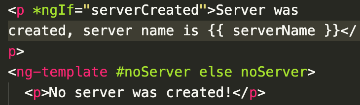
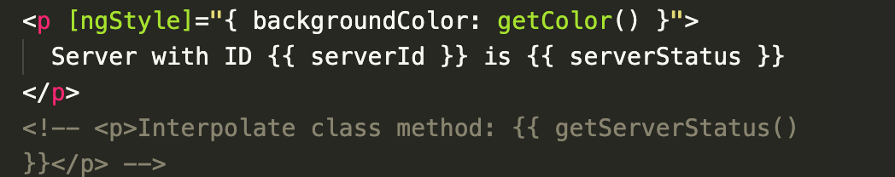
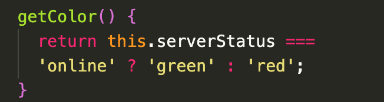

# Notes

- main TS starts and boostraps (passes app.modul.ts) as an argument

### Components

- root component holds app, other components are nested in the app component
- each component has its own template, html, styling, and own logic - separation of concerns
- all app related content lives in app folder
- a component is a typescript class that angular can instantiate
- class decorators enhance components
  - attatched by adding @ infront of them and importing them at the type so that it is known to typescript (i.e., import { Component } from '@angular/core';)
- angular uses components to build web pages and modules to "bundle" them into packages

### Decorators

- attatched by adding @ and importing at top of file
- informaton stored as metadata that tells angular what to do with the class
  configure by passing JS object
- has **selector** which is what allows you to use it in other components
- has **templateUrl** that points to the html file for that component with a **relative path**

### Modules

- just creating the file is not enough, components need to be "registered" in the AppModule
- it needs to be registered in the "declarations" within the AppModule; for TypeScript to find it, the component also needs to be imported at the top. Write the file path **_without_** .ts extension on the end

### Custom Components

- once a component is added to the module, you can use it as a custom component by creating a custom tag

  - i.e. <app-server> </app-server>
  - above will display that component

### Creating components in CLI

- **LEAVE NG SERVER RUNNING - IMPORTANT**
- in CLI : ng g c (ng generate component)
  - creates component ts file, html, spec, and css (4 files)
  - also adds to declarations in AppModule, double check though

### Component Templates

- template property is mandatory at all times
- inline or point to external file
- can either link templateUrl to path of html file OR in "" put html code in the file. If it's multiline, use backticks and template expressions

### Component Styles

- traditional css in that components name.component.css file
- in stylesUrl can also reference multiple style sheet
- can ALSO eliminate styleUrls property and make a styles(plural) property, in array can write strings of inline styles
- **cannot use inline and external files**

### Selectors

- should be **unique**
- cannot select by id or pseudoselectors
- typically create elements and select by elements
- **selectors are what you call the custom component when inserting it in other components**

### Databinding

1. String Interpolation {{ data }} (output data)
2. Property Binding [property]="data (output data)
3. Event Binding (event)="expression" (reaction to user events)
4. Combination of Both: **Two Way Data Binding** [(ngModel)]="data"

### String Interpolation

- only single line expressions or ternarys (no code blocks)
- output _must_ be a string
- Steps

  1. In component.ts, define properties and any methods in the export (bottom of component)
     

  2. in component.html, interpolate using {{  }} syntax

     

### Property Binding

- property binding uses square brackets
- string interpolation vs [innerText] property
- cannot combine property binding with string interpolation - no curly braces inside of property binding quotation marks
- must write typescript code inside property binding

### Event binding

- event binding uses parans e.g., (click)
- example : (click)="onCreateServer()"
- above example, onCreateServer() would be defined in the component.ts as a method
- How do you know to which Properties or Events of HTML Elements you may bind? You can basically bind to all Properties and Events - a good idea is to console.log() the element you're interested in to see which properties and events it offers.
- **Important:** For events, you don't bind to onclick but only to click (=> (click)).

### Passing & Using Data with Event Binding

- input and click events are default provided by the DOM
- can capture this data with $event as an argument to the method we're passing

### Two Way Data binding/combining forms

- Important: For Two-Way-Binding (covered in the next lecture) to work, you need to enable the ngModel directive. This is done by adding the FormsModule to the imports[] array in the AppModule.
- You then also need to add the import from @angular/forms in the app.module.ts file:
- import { FormsModule } from '@angular/forms';

- 2 way event binding combines property and event binding

### Directives

- directions to the DOM
- can be templates or not
- typically made with attributes?
- custom and built in directives
- components are directives

### conditional rendering

- \*ngIf is a structural directive, changes structure of DOM by either adding/not adding
- local reference - kind of like a marker
  2 options for conditional rendering :
  
- unlike structural directives, attribute directives don't add or remove elements from the page, they only change the element they were placed on

### Dynamic Styling

- [ngStyle] - brackets are not part of the directive, they are property binding (binding to a property of the directive)
  
  
